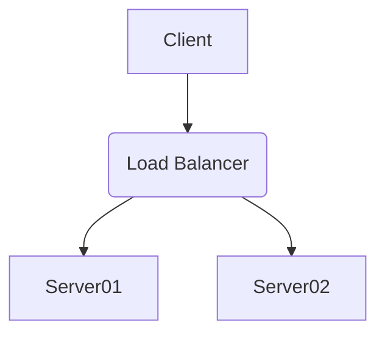

# 00 – Maps of Content (MOCs) & Conventions

This vault serves as the comprehensive documentation for the Next.js application. This note outlines the vault's structure, conventions, and available templates to ensure consistency and ease of navigation.

## 1. Vault Structure (MOCs)

The vault is organized into the following primary sections, each acting as a Map of Content (MOC) for its respective domain:

- **[[00 – MOCs & Conventions]]**: You are here. Guidelines for using and contributing to this vault.
- **[[01 – Setup & Deployment]]**: Instructions for setting up the local development environment, Docker configurations, and deployment procedures.
- **[[02 – System Architecture]]**: High-level overview of the application architecture, including diagrams and module responsibilities.
- **[[03 – Database]]**: Details about the database schema, models, migrations, and Drizzle ORM usage.
- **[[04 – Frontend & API]]**: Documentation for frontend pages, API endpoints, UI components, and data flow.
- **[[05 – User & Permissions]]**: Information on user management, authentication, and authorization.
- **[[06 – Metabase Integration]]**: Guidelines for using the external Metabase instance for analytics and reporting.
- **[[07 – Troubleshooting]]**: Common issues, error patterns, and their solutions.
- **[[08 – Templates & Appendices]]**: Reusable note templates and supplementary materials.

## 2. Naming Conventions

- **File Names**: Use CamelCase or PascalCase for note titles (e.g., `MyNewComponent.md`, `DatabaseSchema.md`). Add numerical prefixes for MOCs and top-level notes for ordering (e.g., `01_Setup_And_Deployment.md`).
- **Folders**: Use kebab-case for folder names if not part of the MOC structure (e.g., `_attachments`, `_code-snippets`). The primary structure uses numbered "–" separated names.
- **Tags**: Use kebab-case for tags (e.g., `#database-schema`, `#api-endpoint`).

## 3. Tagging Guidelines

- **MOC Tags**: Each main MOC file should have a primary tag (e.g., `#moc`, `#setup`, `#database`).
- **Content Tags**: Use descriptive tags to categorize notes (e.g., `#component`, `#api-route`, `#drizzle-model`, `#troubleshooting-guide`).
- **Status Tags**: Optionally use status tags if tracking progress within the docs (e.g., `#draft`, `#review-needed`, `#complete`).

## 4. Linking

- **Internal Links**: Use `[[Wikilinks]]` for internal linking between notes.
- **Backlinks**: Leverage Obsidian's backlinking feature to discover related content.
- **External Links**: Use standard Markdown links `[Text](URL)` for external resources.

## 5. Templates

The vault includes predefined templates to ensure consistency for common documentation types. See [[08_TEMPLATES_AND_APPENDICES#Note Templates]] for details and usage.
    - [[Assay Workflow Template]]
    - [[Component Documentation Template]]
    - [[Troubleshooting Note Template]]

## 6. Code Blocks

- Specify the language for syntax highlighting (e.g., `typescript`, `sql`, `bash`).
- For Drizzle schemas or complex types, consider embedding or linking to the source file if appropriate, or using shorter illustrative snippets.

```typescript
// Example TypeScript code block
export const Greet = (name: string): string => {
  return `Hello, ${name}!`;
};
```

## 7. Mermaid Diagrams

Use Mermaid syntax for diagrams. See [[08_TEMPLATES_AND_APPENDICES#Mermaid Diagram Snippets]] for examples.



## 8. Contribution Guidelines

- Keep documentation concise and to the point.
- Update relevant notes when making significant changes to the codebase.
- If unsure where to document something, start a new note and link it from a relevant MOC or create a new MOC if necessary.
- Use placeholders like `[TODO: Add details...]` for sections that need more information.

---
*This vault is a living document. Please contribute to keeping it accurate and up-to-date.* 