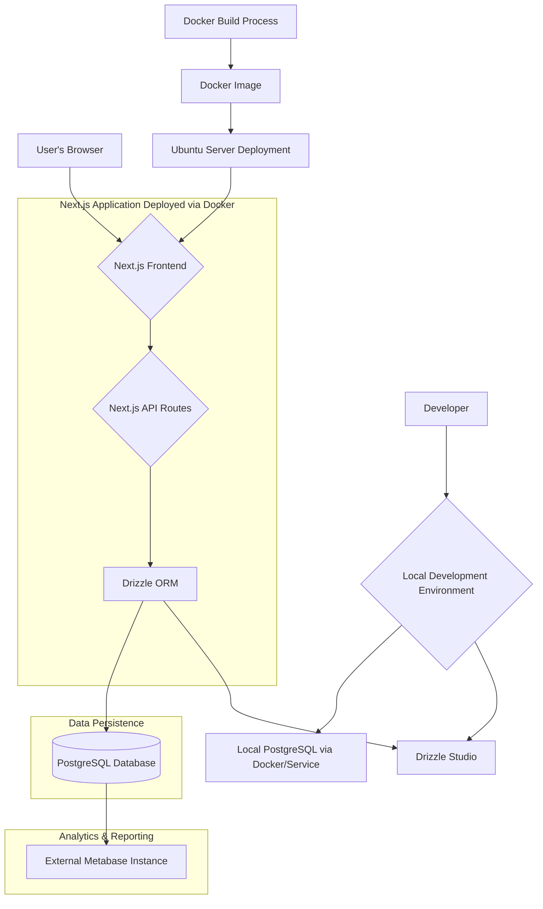

# 02 – System Architecture

This document provides a high-level overview of the application's architecture, including the interaction between different services, key modules, and folder responsibilities.

## 1. Overall System Diagram

The following diagram illustrates the primary components and data flow of the system:

**Key Interactions:**
- **User Interaction**: Users access the Next.js frontend running in their browser.
- **Frontend to API**: The Next.js frontend (using App Router, Server Components, Client Components) makes requests to Next.js API Routes (Route Handlers) for data operations.
- **API to Drizzle**: API Routes use Drizzle ORM to interact with the PostgreSQL database.
- **Drizzle to Postgres**: Drizzle ORM translates TypeScript/JavaScript calls into SQL queries for the PostgreSQL database.
- **Postgres to Metabase**: The external Metabase instance connects to the PostgreSQL database (likely a read replica or with specific permissions) for analytics and reporting.
- **Deployment**: The application is containerized using Docker, built into an image, and deployed on an Ubuntu server.

## 2. Folder Structure & Module Responsibilities

Based on the project scan, here are the key directories and their inferred responsibilities:

- **`src/`**: Core application code.
    - **`src/app/`**: Contains Next.js App Router pages, layouts, API route handlers, and global styles. Each folder typically represents a route segment.
        - `page.tsx`: The main landing page for the root route.
        - `layout.tsx`: The root layout for the application.
        - `globals.css`: Global stylesheets.
        - `providers.tsx`: Client-side context providers.
        - `api/`: Server-side API route handlers.
        - `auth/`: Authentication-related pages/routes (e.g., NextAuth.js callbacks, login page if not a top-level route).
        - `admin/`: Admin dashboard and functionalities.
        - `dashboard/`: Main user dashboard.
        - `data-download/`, `data-entry/`, `data-import/`: Feature sections for data operations.
        - `patients/`, `samples/`, `subjects/`, `visits/`: Sections for managing specific data entities.
        - `login/`, `logout/`, `profile/`, `registration/`, `settings/`: User account and session management pages.
        - `query-builder/`: Interface for building queries.
    - **`src/components/`**: Reusable UI components (React components).
        - `ui/`: Generic, reusable UI primitives (e.g., buttons, inputs, cards), likely from Shadcn UI (as per `components.json`).
        - `auth/`, `dashboard/`, `data/`, `data-download/`, `data-entry/`, `data-import/`, `forms/`, `layout/`, `patients/`, `query/`, `registration/`, `samples/`, `subjects/`, `visits/`: Feature-specific or layout-specific components.
        - Example custom components: `SamplesTable.tsx` (in `src/components/samples/`), `SimpleAdviaForm.tsx` (in `src/components/forms/`).
    - **`src/lib/`**: Shared libraries, utilities, and helper functions.
        - `auth/`: Authentication utility functions (e.g., session helpers, NextAuth.js config access).
        - `db/`: Core database interaction logic, likely Drizzle ORM setup (`src/lib/db/schema.ts`), Drizzle client instance, query functions.
        - `drizzle/`: May contain Drizzle-specific utilities or schema parts. Note: Root `drizzle/` folder contains migrations and `drizzle.config.ts`.
        - `types/` & `types.ts`: Shared TypeScript type definitions.
        - `utils/` & `utils.ts`: Common utility functions.
        - `apiClient.ts`: Helper for client-side API calls.
        - `db-helpers.ts`: Additional database utility functions.
        - `services/`: Business logic or interactions with external services.
        - `placeholder-data.ts`, `queryTemplates.ts`, `metadata-cache.ts`: Utility files for development, queries, and caching.
        - `[NOTE: Contains remnants of Prisma (`prisma/`, `prisma.ts`, `prisma-helpers.ts`) and Supabase (`supabase/`) which have been largely replaced by Drizzle. These may need cleanup or could be a source of confusion.]`

- **`drizzle/`** (Root directory): Contains Drizzle ORM migration files (`drizzle/migrations/`) generated by Drizzle Kit. The main Drizzle configuration (`drizzle.config.ts`) is also at the root.

- **`public/`**: Static assets that are served directly (e.g., images, fonts, `favicon.ico`).

- **`scripts/`** (Root directory): Utility scripts for development or specific tasks.
    - `create-admin.ts`: Script to create an admin user (callable via `npm run create-admin`).
    - `seed-admin.mjs`, `seed-admin.ts`: Likely related scripts for seeding admin user data.

- **`node_modules/`**: Project dependencies (managed by `npm` as per `package-lock.json`).

- **`.next/`**: Build output from Next.js (automatically generated).

- **Configuration Files (Root):**
    - `next.config.mjs`: Next.js configuration file.
    - `tailwind.config.ts`: Tailwind CSS configuration.
    - `postcss.config.mjs`: PostCSS configuration.
    - `tsconfig.json`: TypeScript configuration.
    - `package.json`: Project metadata, dependencies (`npm`), and scripts.
    - `Dockerfile`: Docker image definition.
    - `.dockerignore`: Files to ignore for Docker builds.
    - `.gitignore`: Files to ignore for Git.
    - `drizzle.config.ts`: Drizzle Kit configuration.
    - `components.json`: Configuration for Shadcn UI (or similar component library).
    - `jest.config.js`: Jest test runner configuration.

## 3. Data Flow

Refer to [[04_FRONTEND_AND_API#Data Flow through Pages → API Routes → Drizzle]] for a more detailed explanation of how data moves through the application from the frontend to the database.

## 4. Key Technologies & Services

- **Frontend**: Next.js (App Router, React, TypeScript)
- **Styling**: Tailwind CSS, Shadcn UI (inferred from `components.json` and `src/components/ui/`)
- **Backend/API**: Next.js API Routes (Route Handlers)
- **ORM**: Drizzle ORM
- **Database**: PostgreSQL
- **Containerization**: Docker
- **Deployment Target**: Ubuntu Server
- **Analytics/Reporting**: External Metabase Instance
- **Package Manager**: npm (confirmed from `package-lock.json` and `Dockerfile`)
- **Linting**: ESLint (from `package.json` script `lint: "next lint"`).
- **Testing**: Jest (from `jest.config.js` and `package.json` scripts).

---
Links to: [[01 – Setup & Deployment]], [[03 – Database]], [[04 – Frontend & API]] 