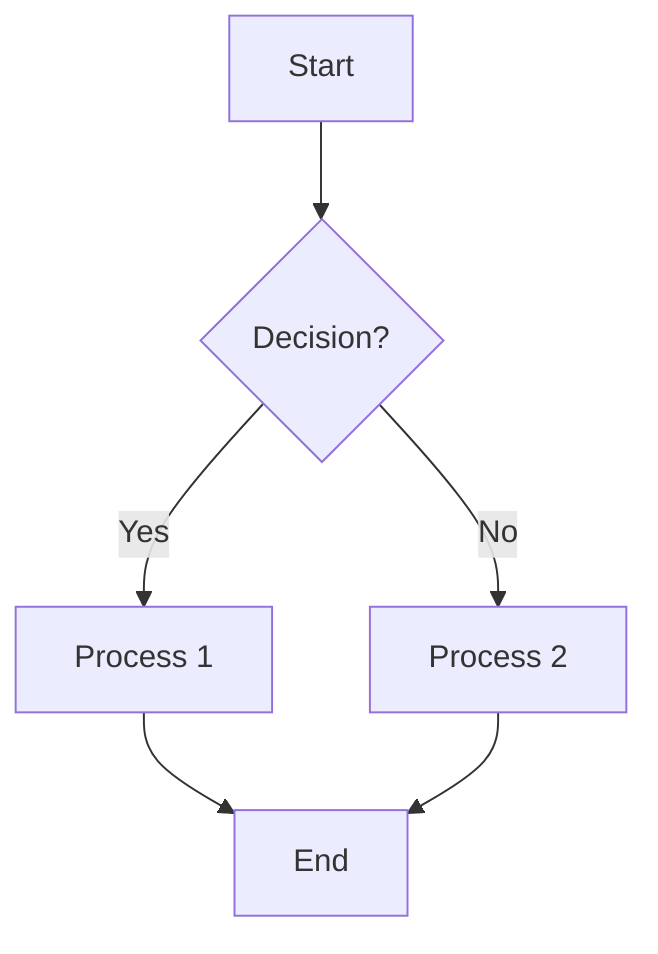
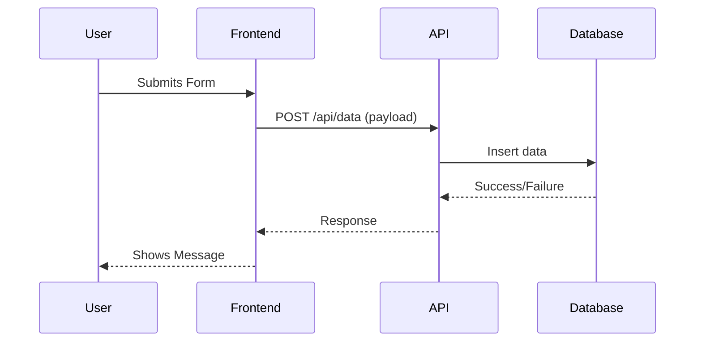

# 08 – Templates & Appendices

This section provides reusable Obsidian note templates to ensure consistent documentation and contains appendices for frequently used code snippets or diagram examples.

## 1. Note Templates

To use a template, create a new note and copy-paste the content from the desired template below. Then, fill in the specific details.
Consider using Obsidian's built-in templating features or a community plugin like "Templater" for a more automated workflow if desired.

### 1.1. [[Assay Workflow Template]]

Use this template to document the end-to-end process for a specific assay, from data input to result generation and interpretation.

```markdown
---
tags: [assay-workflow, [assay-name]] # e.g., [assay-workflow, dna-extraction]
aliases: [[Specific Assay Name] Workflow]
related_db_tables: [[table_name_1]], [[table_name_2]]
related_api_endpoints: [/api/assay/[assay-name]]
related_ui_components: [[MyAssayForm]], [[MyAssayResultsDisplay]]
---

# [Assay Name] Workflow

**Last Reviewed**: YYYY-MM-DD
**Owner**: @[username/team]

## 1. Overview

Brief description of the assay and its purpose.

## 2. Data Inputs

-   **Source System(s)**: [e.g., LIMS, Manual Entry Form]
-   **Key Data Points**: 
    -   [Data Point 1]: [Description]
    -   [Data Point 2]: [Description]
-   **Relevant Database Table(s)**: [[table_name_for_inputs]]

## 3. Processing Steps

1.  **Step 1**: [Description]
    -   Associated UI: [[Relevant UI Component for Step 1]]
    -   Associated API: `POST /api/assay/[assay-name]/step1`
    -   Key Logic/File: `src/lib/assays/[assay_name]_logic.ts`
2.  **Step 2**: [Description]
    -   ...

## 4. Output / Results

-   **Key Metrics Generated**: 
    -   [Metric 1]: [Description]
    -   [Metric 2]: [Description]
-   **Storage**: [[results_table_for_assay]]
-   **Display**: [[UI Component for Results]], Metabase Dashboard [[Link to Metabase Dashboard]]

## 5. QC / Validation

-   [QC Check 1]: [Criteria]
-   [QC Check 2]: [Criteria]

## 6. Troubleshooting

-   **Common Issue 1**: [Symptom]
    -   **Solution**: See [[Troubleshooting Note - Assay Issue Example]]
-   **Common Issue 2**: [Symptom]
    -   **Solution**: ...

## 7. Downstream Dependencies

-   [System/Report 1 that uses these results]
-   [System/Report 2 that uses these results]

## 8. Notes & Considerations

[Any other relevant information]
```

### 1.2. [[Component Documentation Template]]

Use this template for documenting individual React/Next.js UI components.

```markdown
---
tags: [component, ui, [feature-area]] # e.g., [component, ui, forms], [component, ui, navigation]
aliases: [[Specific Component Name]]
filepath: src/components/ui/[ComponentName].tsx
storybook_link: (if applicable)
---

# Component: `[ComponentName]`

**Last Reviewed**: YYYY-MM-DD
**Owner**: @[username/team]

## 1. Overview

Brief description of the component and its purpose within the UI.
Is it a Server Component or Client Component (`"use client"`)?

## 2. Props

| Prop Name   | Type                        | Default Value | Description                                     |
|-------------|-----------------------------|---------------|-------------------------------------------------|
| `propName1` | `string`                    | `"default"`   | Description of what this prop does.             |
| `propName2` | `number \| undefined`       | `undefined`   | Optional number prop.                           |
| `onClick`   | `() => void`                |               | Callback function for click events.             |
| `children`  | `React.ReactNode`           |               | Content to be rendered inside the component.    |
| `...`       |                             |               |                                                 |

*Code Reference for Props type definition:*
```typescript
// Paste the type definition for the component's props here
export type [ComponentName]Props = {
  propName1?: string;
  propName2?: number;
  onClick?: () => void;
  children?: React.ReactNode;
};
```

## 3. Usage Examples

### Basic Usage
```tsx
<[ComponentName] propName1="Example" />
```

### With Optional Props
```tsx
<[ComponentName] propName1="Another Example" propName2={123} onClick={() => console.log("Clicked!")}>
  <p>Child content</p>
</[ComponentName]>
```

## 4. Styling

- Primary styling is done via Tailwind CSS utility classes applied directly in the JSX.
- Key structural classes: `[List important classes or structure if complex]`
- Variants (if any): `[Describe different visual variants if applicable]`

## 5. State & Logic (if applicable, primarily for Client Components)

- [Describe any internal state managed by the component]
- [Describe key event handlers or effects]

## 6. Accessibility

- `aria-label`: [If applicable, how is it set or used?]
- Keyboard Navigation: [Describe keyboard interactions]
- Focus Management: [Describe focus behavior]
- `[TODO: Add other relevant accessibility considerations, e.g., role attributes]`

## 7. Dependencies

- [[OtherComponent1]] (if it uses other custom components)
- Shadcn UI Primitives: `[e.g., Button, Input from @/components/ui]`

## 8. Notes & TODOs

- [Any special considerations, limitations, or future improvement ideas]
- `[TODO: Specific items to complete for this component's documentation or functionality]`
```

### 1.3. [[Troubleshooting Note Template]]

Use this template to document a specific issue, its symptoms, and the resolution steps.

```markdown
---
tags: [troubleshooting-note, [area]] # e.g., [troubleshooting-note, database], [troubleshooting-note, docker]
aliases: [Fix for [Brief Error Description]]
date_resolved: YYYY-MM-DD
---

# Troubleshooting: [Brief Error Description or Symptom]

## 1. Symptoms

- [Symptom 1, e.g., Error message observed in logs]
- [Symptom 2, e.g., Incorrect behavior in UI]
- [Symptom 3, e.g., System performance degradation]

## 2. Environment

- **Where Occurred**: [e.g., Local Dev, Staging, Production]
- **Relevant Versions**: 
    - Next.js: [version]
    - Drizzle: [version]
    - Node.js: [version]
    - Docker: [version]
    - Browser: [if applicable]
- **Specific Configuration**: [Any non-standard setup that might be relevant]

## 3. Investigation Steps

1.  [Step 1 taken to diagnose, e.g., Checked Docker logs at /var/log/...]
2.  [Step 2 taken, e.g., Queried PostgreSQL table X for specific records]
3.  [Observation from Step X]

## 4. Root Cause

[Brief explanation of the underlying cause of the issue.]

## 5. Resolution

1.  [Step 1 of the fix, e.g., Modified `Dockerfile` to include X]
2.  [Step 2 of the fix, e.g., Ran SQL command Y to update records]
    ```sql
    -- Example SQL command
    UPDATE your_table SET column = 'value' WHERE condition;
    ```
3.  [Step 3 of the fix, e.g., Restarted Docker container Z]

## 6. Verification

- [How was the fix verified? e.g., Confirmed correct data in UI, no more error messages in logs]

## 7. Prevention / Lessons Learned

- [How can this issue be prevented in the future? e.g., Add validation to API endpoint, improve monitoring for X]
- [Any broader takeaways?]

## 8. Related Links

- [[Relevant MOC like 07_TROUBLESHOOTING]]
- [Link to GitHub Issue, Slack thread, or external documentation]
```

## 2. Code Snippet Embeds

For frequently referenced small code snippets that don't warrant their own file but are useful across multiple documents.

### Example: Drizzle Schema Excerpt
```typescript
// src/lib/db/schema.ts (Illustrative)
export const usersInApp = app.table("users", {
  id: uuid().defaultRandom().primaryKey().notNull(),
  name: varchar("name", { length: 255 }),
  email: varchar("email", { length: 255 }).unique().notNull(),
  // ... other fields
});
```

### Example: Tailwind Button Component
```tsx
// src/components/ui/Button.tsx (Illustrative)
export const Button = ({ children, className, ...props }) => {
  return (
    <button 
      className={`px-4 py-2 bg-blue-500 text-white rounded ${className}`}
      {...props}
    >
      {children}
    </button>
  );
};
```

## 3. Mermaid Diagram Snippets

Examples of Mermaid diagrams for quick reference.

### Basic Flowchart


### Sequence Diagram


### ER Diagram (Conceptual for Drizzle)
```mermaid
erDiagram
    usersInApp {
        UUID id PK
        varchar name
        varchar email UK
        timestamp createdAt
    }
    samplesInLaboratory {
        varchar sample_id PK
        varchar subject_id FK
        integer sample_number
        date date_of_collection
    }
    usersInApp ||--o{ samplesInLaboratory : "has many (conceptually, if linked)"
    // Note: Drizzle defines relations in code, Mermaid ER is for visualization
```

---
Links to: [[00 – MOCs & Conventions]] 